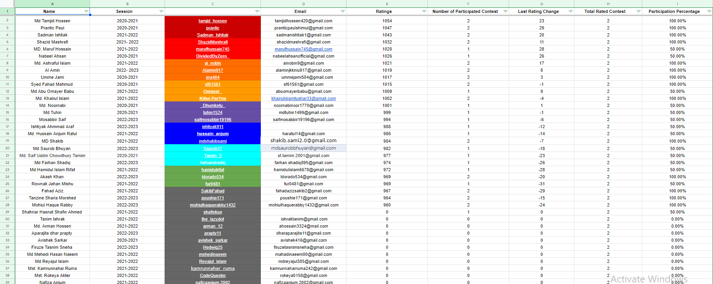
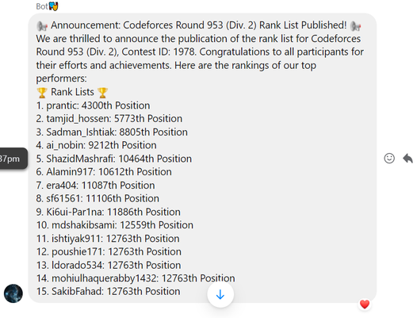
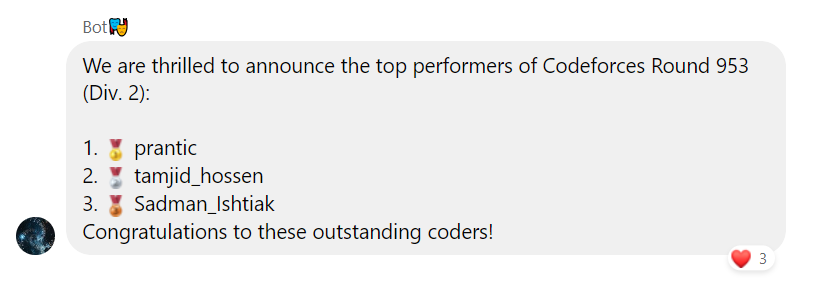

# University Student Ranking System According to Codeforces Contest

## Description

The University Student Ranking System is designed to track the performance of Computer Science students in coding contests hosted on Codeforces. This system motivates students by announcing the top contestants in a Facebook Messenger group and facilitates team formation using Google Sheets. By integrating with the Google Sheets API and Codeforces API, our system efficiently manages and tracks student performance, providing a detailed ranking list based on their Codeforces handles.

## Features

- **Automatic Contest Updates**: Posts upcoming contests and rankings in the specified Facebook group.
- **Real-time Ranking**: Fetches and displays the ranking of students in specific Codeforces contests.
- **Top Contestant Announcements**: Automatically announces the top 3 coders in the Facebook group.
- **Google Sheets Integration**: Updates and retrieves student data from a Google Sheet.
- **Elo Rating System**: Calculates and tracks student ratings using the Codeforces Elo rating system.

## Installation

To set up the University Student Ranking System, follow these steps:

1. **Clone the Repository**:
    ```bash
    git clone https://github.com/your-username/university-student-ranking-system.git
    cd university-student-ranking-system
    ```

2. **Install Dependencies**:
    Ensure you have Python and pip installed. Then, install the required packages:
    ```bash
    pip install -r requirements.txt
    ```


4. **Set Up Google Sheets API**:
    - Go to the Google Cloud Console.
    - Enable the Google Sheets API and Google Drive API.
    - Create credentials and download the `credentials.json` file.
    - Share your Google Sheet with the email listed in the `credentials.json`.

5. **Run the Application**:
    Start the application to begin tracking and ranking:
    ```bash
    python main.py
    ```
### Adding Students

To add students to the ranking system:
1. Update the Google Sheet with student names and their Codeforces handles.
2. Ensure the sheet is properly formatted as per the application's requirements.

### Google Sheet Result and Messenger Announcement




